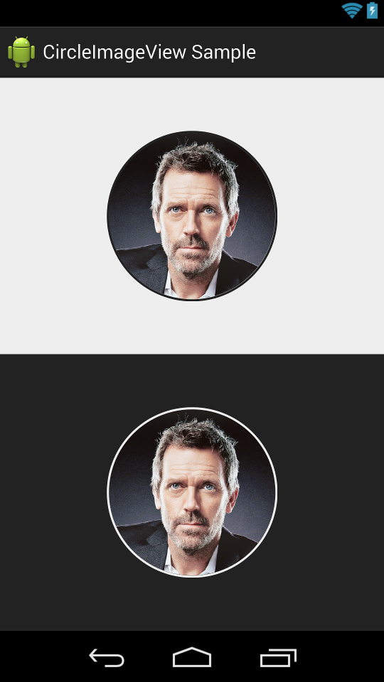

# Android---Image
##Github上的Image相关收集

**1.在开源ImageFilterForAndroid中拥有许多丰富的图片效果，是由来自国内的代震军发起的一个开源项目。**             
项目地址:https://github.com/daizhenjun/ImageFilterForAndroid              

2.Picasso:这是Square的开源项目，Picasso是一个用于Android平台上的下载和缓存图片的项目。它有许多定制选项，如何处理下载图片（包括调整和裁剪，以及提供一个接口让你随自己心意将图片转换成圆角等）。Picasso将要下载的图片（如果没有缓存）并将它负载到指定的目标，转换图片以适合所显示的ImageView，来减少内存消耗。      
http://square.github.io/picasso/     

**3.Android image cropping library.图片裁剪工具.https://github.com/lyft/scissors**             
        

**4.This project is an implementation of the User Profile Interface Animation. **                  
项目地址:https://github.com/Yalantis/Euclid             

**5.An android library to display a progressbar that goes around an image. 图片周围的进度条.**           
项目地址:https://github.com/mrwonderman/android-square-progressbar          
        

**6.圆形图片控件.A circular ImageView for Android.https://github.com/hdodenhof/CircleImageView**            
          

**7.android powerful picture picker :图片选择库的轮子**      
https://github.com/ValuesFeng/AndroidPicturePicker                

**8.一个基于Picasso的图片多选库**    
https://github.com/wuapnjie/PoiPhoto      

**9.ShapedImageView : 支持圆形 圆角矩形,支持显示边框,支持TransitionDrawable**  
https://github.com/gavinliu/ShapedImageView    

**10.Sketch是用于Android上的一个图片加载器，目的是为了帮助开发者从本地或网络读取图片，然后处理并显示在页面上 Sketch is for Android on a picture of the loader, the purpose is to help the developers to read the image from a local or network, then processed and displayed on the page**    
https://github.com/xiaopansky/Sketch    

**11.对 ImageView 实现了全屏浏览效果，同时支持了图片缩放效果，和滑动消失效果**            
https://github.com/stfalcon-studio/FrescoImageViewer   

**12.TedBottomPicker is simple image picker using bottom sheet**           
https://github.com/ParkSangGwon/TedBottomPicker          

**13.**

